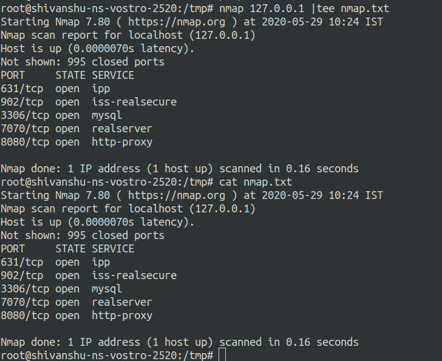

# Enterprise-Networking-Squad
All the tasks of Enterprise Networking Squad goes here.


##Linux Utilities to Save Outputs


### Using '>'
 Use ">" with any command to save the output in a text format.

### Using 'tee'
Use "command| tee [filename]" to save the output of any command and view progress at the same time.
example: 
```
nmap 127.0.0.1 |tee nmap.txt
```
.png)

### Using grep and cut to get proper output
```
nmap 127.0.0.1 | grep "open"| cut -d "/" -f1 #Gets port numbers only
```



1. Use grep with a unique word in line to eliminate unwanted lines.
2. Now, use "cut" with "-d" to set a delimiter to distinguish fields and use "-f[int]" to set wanted field char.
3. Use "sort -u" to get output in sorted form. 
